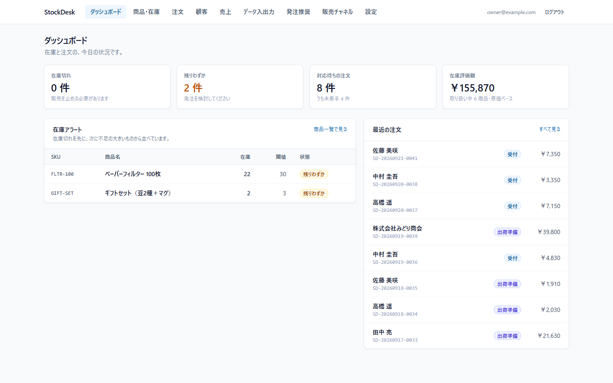
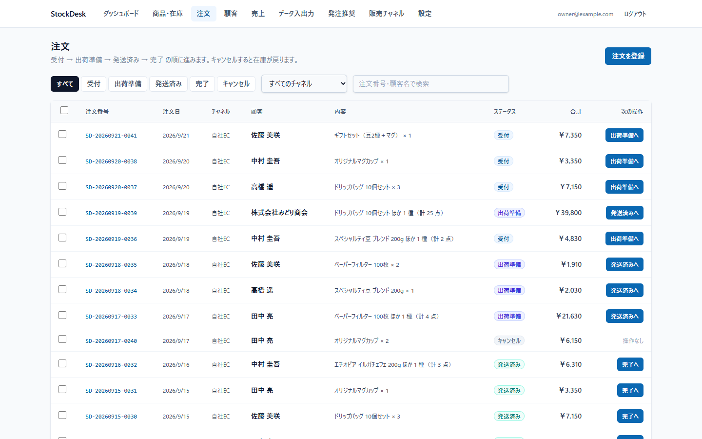
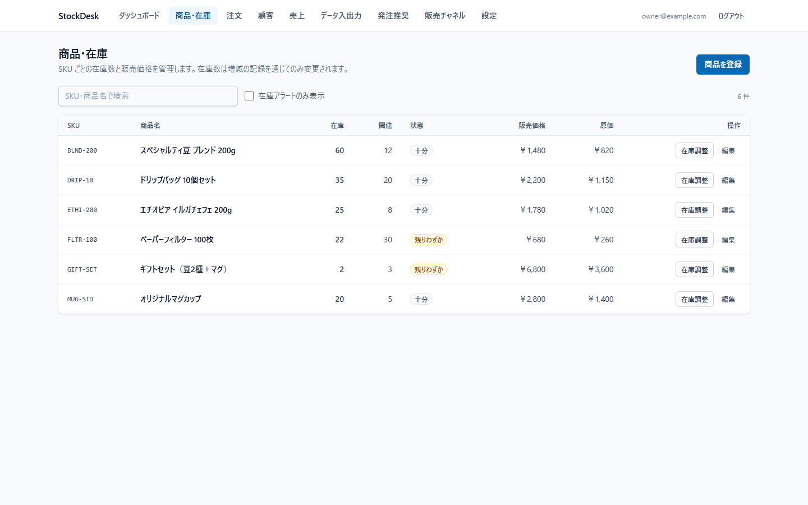
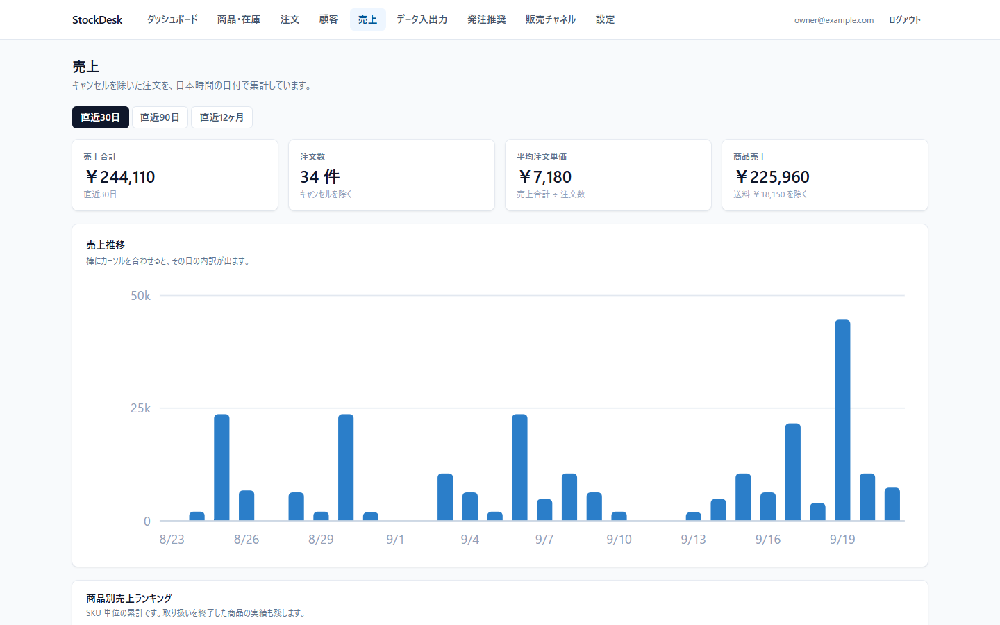
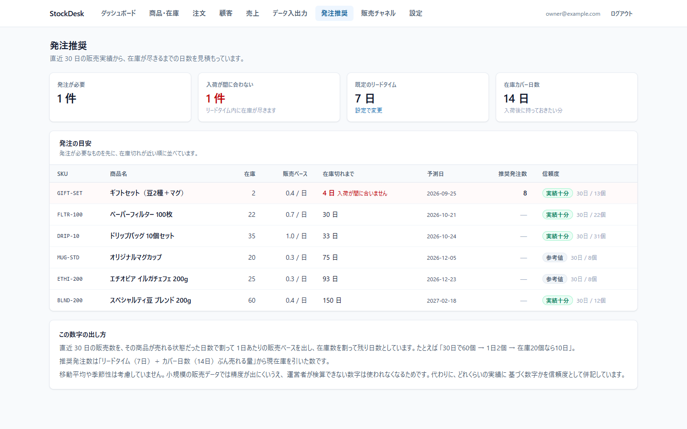
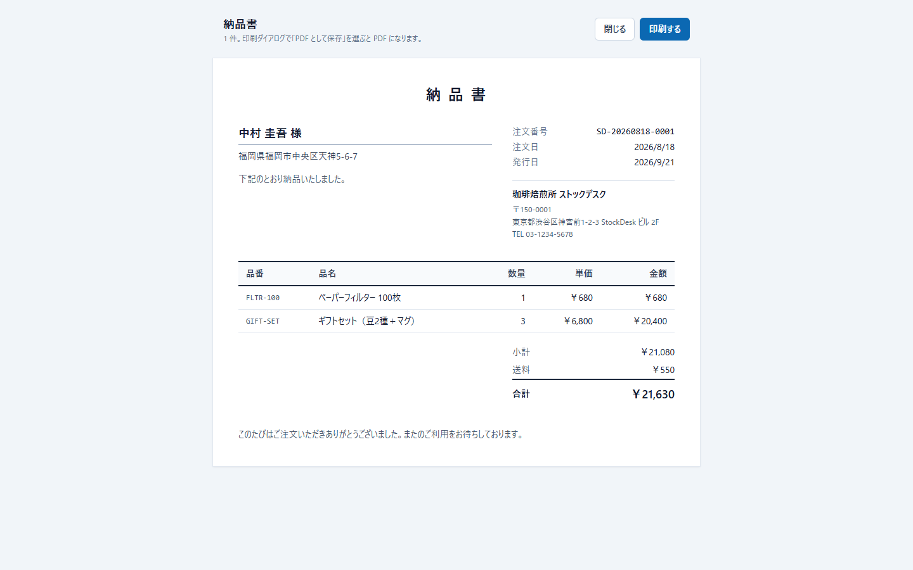
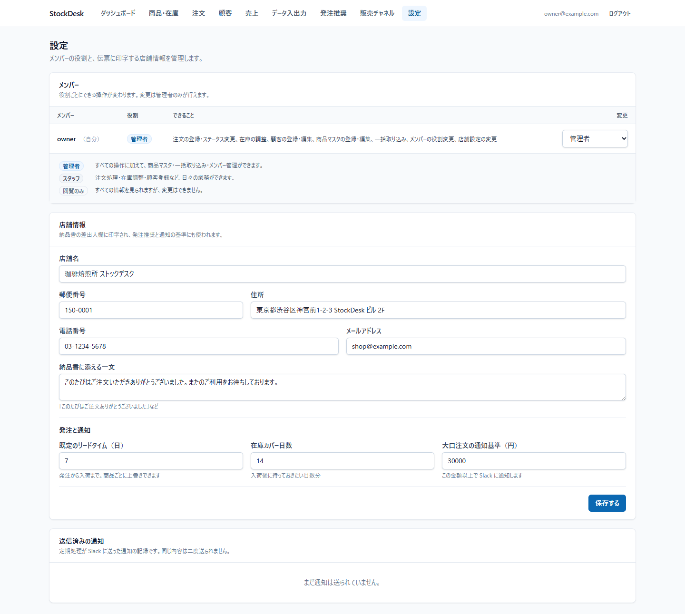

# StockDesk

小規模EC事業者向けの、バックオフィス管理システム。商品（SKU）・在庫・注文・顧客をひとつの画面で扱う。

**全4フェーズ完了。** 商品・在庫・注文（Phase 1）、顧客・売上・CSV（Phase 2）、権限管理・帳票・複数チャネル（Phase 3）、Slack 通知・発注推奨（Phase 4）が動作する。

---

## 画面

### ダッシュボード

在庫アラートと対応待ちの注文を最上段に置いている。売上のグラフは別画面にあり、ここには「今すぐ手を打つべきこと」だけを出す。



### 注文

自社EC・CSV 取り込み・外部モールの注文が1つの一覧に統合される。各行から次の工程へ1クリックで進められ、複数選択して納品書・出荷ラベルをまとめて印刷できる。



### 商品・在庫

在庫数は増減の記録を通じてのみ変わる。この画面から直接書き換えることはできない（DB 側でも列単位の権限で拒否される）。



### 売上

集計は Postgres のビューが行い、日付は日本時間で切る。売れなかった日も棒の位置を残している。



### 発注推奨

販売ペースから在庫切れまでの日数を見積もる。数字の根拠（何日ぶんの実績か・何個売れたか）と信頼度を必ず併記し、実績が足りない商品は予測しない。



### 納品書

ブラウザの印刷機能で出力する。明細は注文時点のスナップショットなので、商品マスタを後から変更しても発行済みの伝票と食い違わない。



### 設定（メンバーと権限）

役割ごとにできる操作が変わる。誰が何をできるかは権限の無い人にも見えるようにし、変更の操作だけを管理者に限っている。



ほかの画面（顧客・データ入出力・販売チャネル・注文詳細・出荷ラベル）は [`docs/images/`](docs/images/) を参照。

---

## 何を解決するのか

小規模ショップの在庫管理は、実際にはスプレッドシートで回っていることが多い。そこで起きる問題は主に2つある。

1. **売り越し** — 在庫がないのに受注してしまう。手入力の更新では、注文と在庫の反映にずれが出る。
2. **原因が追えない** — 在庫数が合わないとき、いつ誰が何をしたのかが残っていない。

StockDesk はこの2点を設計の中心に置いている。在庫は「数値を書き換えるもの」ではなく「増減の記録が積み上がった結果」として扱い、注文の受付と在庫の引き当てを同一トランザクションで実行する。

---

## 技術スタック

| 領域            | 採用                                |
| --------------- | ----------------------------------- |
| フロントエンド  | React 18 + TypeScript + Vite        |
| スタイリング    | Tailwind CSS v4                     |
| データ取得      | TanStack Query                      |
| フォーム / 検証 | React Hook Form + zod               |
| DB / 認証       | Supabase（PostgreSQL + Auth + RLS） |
| 定期処理        | Cloudflare Workers + Cron Triggers  |
| テスト          | Vitest                              |

### なぜ Next.js ではなく Vite なのか

StockDesk は**認証の内側だけで動く管理画面**で、公開ページも SEO も OGP も必要ない。Next.js の主な価値である SSR / ISR / RSC はこのアプリではほぼ使われず、ビルドとデプロイの複雑さだけが増える。

加えて本システムは、権限の境界を DB の RLS に置き、**独自の API サーバーを持たない**構成を採っている。Next.js の Route Handlers や Server Actions を使うなら、そこに認可を書くことになり、境界が二重化する。定期処理という「サーバーが要る唯一の部分」は Cloudflare Workers が担当する。

結果として、静的ビルドを CDN に置くだけで完結する Vite が構成として最も単純になる。

**この判断が変わる条件**は明確にしておく。外部モールとの実 API 連携（Phase 3 の本実装）で、秘密鍵を持つサーバー側処理が常時必要になった場合、Workers だけでは手狭になる。そのときは API 層を足すか、Next.js への移行を検討する。

### なぜ独自 API サーバーを持たないのか

ブラウザから PostgREST 経由で Postgres に直接アクセスする構成には、「アプリのコードを信用しない」という前提が要る。そのため、**守るべき規則はすべて DB 側に置いてある**。

- 在庫の増減は `apply_stock_movement()` 経由でしか起こせない（RLS + 列単位 GRANT で直接更新を拒否）
- 注文ステータスの遷移規則は `is_valid_order_transition()` が強制する
- 誰が何を読み書きできるかは RLS ポリシーが決める

画面側にも同じ規則のコピーがあるが（`packages/core`）、それは**押せないボタンを描かないため**であって、防御ではない。

---

## セットアップ

必要なもの: Node.js 22 以上 / pnpm 10 以上 / Docker（ローカル Supabase 用）

```bash
pnpm install
pnpm db:start      # ローカル Supabase を起動（初回は Docker イメージの取得に時間がかかる）
pnpm db:reset      # マイグレーション適用 + シード投入
```

`pnpm db:start` が出力する API URL と anon key を `apps/web/.env` に書く。

```
VITE_SUPABASE_URL=http://127.0.0.1:54321
VITE_SUPABASE_ANON_KEY=<anon key>
```

```bash
pnpm dev           # http://localhost:5173
```

シードは約5週間ぶんの注文（41件）を投入する。数日ぶんのデータでは売上推移が数本の棒にしかならず、発注推奨も「実績不足」ばかりになって、作った機能を確かめられないため。在庫は「5週間売れたあとにアラート域に入る」よう逆算してある。

初回はログイン画面から「はじめて利用する」でアカウントを作る。**最初に登録したユーザーが owner になる**（DB トリガ `handle_new_user()`）。

### よく使うコマンド

| コマンド         | 内容                               |
| ---------------- | ---------------------------------- |
| `pnpm dev`       | 開発サーバー                       |
| `pnpm test`      | 業務ロジックのテスト               |
| `pnpm typecheck` | 全パッケージの型チェック           |
| `pnpm build`     | 本番ビルド                         |
| `pnpm db:reset`  | DB を作り直してシード投入          |
| `pnpm db:types`  | スキーマから TypeScript 型を再生成 |

---

## ディレクトリ構成

```
stockdesk/
├─ apps/
│  ├─ web/                     React + Vite の管理画面
│  │  └─ src/
│  │     ├─ components/        画面共通の部品
│  │     ├─ features/          機能ごとの垂直分割
│  │     │  ├─ auth/
│  │     │  ├─ customers/      顧客管理
│  │     │  ├─ dashboard/
│  │     │  ├─ data/           CSV 取り込み / 書き出し
│  │     │  ├─ channels/      販売チャネル連携（モック）
│  │     │  ├─ orders/
│  │     │  ├─ print/         納品書・出荷ラベル
│  │     │  ├─ products/
│  │     │  ├─ reorder/       発注推奨
│  │     │  ├─ sales/         売上集計
│  │     │  └─ settings/      メンバー・店舗設定
│  │     └─ lib/               Supabase クライアント、クエリキー
│  └─ cron/                    Cloudflare Workers（在庫アラートの定期チェック）
├─ packages/
│  └─ core/                    業務ロジック・型・zod スキーマ（テストはここに集中）
├─ supabase/
│  ├─ migrations/              スキーマ / RPC 関数 / RLS
│  └─ seed.sql                 ローカル開発用データ
└─ docs/
   ├─ schema.md                テーブル設計と業務ロジックの詳細
   └─ decisions.md             設計判断の記録
```

`features/` を機能ごとに縦に割っているのは、業務システムが「機能単位」で増えていくため。`components/` `hooks/` `api/` のように層で割ると、注文まわりを変更するたびに4つのディレクトリを行き来することになる。

`packages/core` に業務ロジックを切り出したのは、**DB も React も起動せずに検証できる状態を保つため**。在庫と注文という最も壊れやすい部分を、往復の遅い E2E ではなく高速な単体テストで押さえられる。画面（web）と定期処理（cron）が同じ規則を共有できる利点もある。

---

## 在庫の設計

### 台帳 + キャッシュ

在庫数を `products.stock_quantity` という単一の数値で持つのではなく、`stock_movements`（追記専用の増減台帳）を真実とする。

```
stock_movements          products.stock_quantity
 +60  入荷                       60
  -2  注文引き当て               58
 -15  注文引き当て               43
  +2  キャンセル戻し             45   ← 台帳の合計と常に一致する
```

`products.stock_quantity` は台帳の集計キャッシュであり、両者は必ず同じトランザクションで更新される。ずれていないかは `verify_stock_integrity()` で検査できる。

台帳を持つ理由は3つある。

1. **原因が追える** — 在庫が合わないとき、いつ・なぜ動いたかが残る
2. **同時更新に強い** — 「新しい値を書く」方式は後勝ちで相手の更新を消すが、「増減を記録する」方式なら両方が正しく反映される
3. **将来の分析にそのまま使える** — Phase 4 の発注推奨（販売ペースからの在庫切れ予測）に必要な履歴が、追加の作り込みなしに揃う

コストは書き込み量が増えることだが、小規模ECの規模では問題にならない。

### 引き当てのタイミング

**注文の受付時点で引き当てる**（発送時ではない）。

小規模ECで損失が最も大きいのは売り越し（在庫がないのに受注すること）であり、受付時に引き当てれば、次の注文はその時点で在庫不足として弾かれる。キャンセル時には `order_cancelled` として在庫を戻す。

二重処理は `orders.stock_committed` フラグで防ぐ。キャンセル処理が二度走っても、在庫が二重に戻ることはない。

なお**発送済みからはキャンセルできない**。発送後の取り消しは返品であり、在庫は検品を経てから戻すべきで、キャンセルと同じ即時戻しをしてはいけないため。返品フローは別途設ける。

### 同時実行への対処

在庫の引き当ては「読む → 引く → 書く」の read-modify-write で、ブラウザから3回に分けて実行すると同時注文で必ず競合する。

そこで `create_order()` / `update_order_status()` / `adjust_stock()` を Postgres 関数として実装し、1トランザクション内で `SELECT ... FOR UPDATE` の行ロックを取る。複数商品を含む注文では、**`product_id` の昇順でロックを取得**してデッドロックを避けている。

---

## 注文ステータス

```
  受付(pending) ──→ 出荷準備(preparing) ──→ 発送済み(shipped) ──→ 完了(completed)
      │                    │
      └────────────────────┴──→ キャンセル(cancelled)   ※在庫が戻る
```

遷移規則はホワイトリスト方式で、表に無い組み合わせはすべて禁止（工程の飛ばし、後戻り、同一状態への遷移を含む）。

同じ表が2箇所にある。

- `supabase/migrations/..._functions.sql` の `is_valid_order_transition()` — **規則を守らせる**
- `packages/core/src/order-status.ts` — **規則を見せる**（画面に出すボタンの生成）

二重管理のリスクは、全 25 通りの組み合わせを網羅したテスト（`order-status.test.ts`）で検知する。

---

## テスト方針

テストは **在庫の増減とステータス遷移**に絞っている。画面のスナップショットや CRUD の往復は、壊れたときの被害に対して維持コストが見合わないため書いていない。

対象は「間違うと金銭的な損失やデータの不整合に直結する計算」。

```bash
pnpm test
```

| 対象               | 確認していること                                                |
| ------------------ | --------------------------------------------------------------- |
| ステータス遷移     | 25 通り全組み合わせ、工程飛ばし・後戻りの拒否、在庫戻しの冪等性 |
| 在庫増減           | 境界（在庫ちょうど 0）、不足時の拒否、台帳からの再計算          |
| 在庫水準の評価     | 閾値の境界（以下で警告）、閾値 0 の意味                         |
| 注文の在庫充足判定 | 同一商品が複数行に分かれた場合の合算                            |
| アラートの並び順   | 在庫切れ優先、不足の大きい順、同点時の安定性                    |

---

## 定期処理（Cloudflare Workers）

`apps/cron` が Cron Triggers で毎日 JST 09:00 に在庫をチェックする。開店前に「今日発注すべきもの」が手元にある状態を作るのが目的。

判定には画面と同じ `@stockdesk/core` の `collectStockAlerts()` を使うため、「ダッシュボードには出ているのに通知が来ない」というずれが起きない。

Phase 1 では判定とメッセージ生成まで実装し、実際の送信手段は差し替え可能な形にしてある（Phase 4 で Slack 通知を追加予定）。

```bash
pnpm --filter @stockdesk/cron dev   # GET すると現時点のアラートが返る
```

service_role キーは `wrangler secret put SUPABASE_SERVICE_ROLE_KEY` で登録し、ファイルには置かない。このキーは RLS を迂回できるため、ブラウザ側の環境変数には絶対に設定しない。

---

## 売上集計（Phase 2）

集計は Postgres のビュー（`daily_sales` / `monthly_sales` / `product_sales` / `customer_summary`）が行う。Phase 1 ではクライアント側で集計していたが、売上推移は全注文を取得しないと描けないため、[`docs/decisions.md`](./docs/decisions.md) に書いた「判断が変わる条件」に到達した時点で DB 側へ移した。

**日付は日本時間で切る。** DB のタイムゾーンは UTC なので、`ordered_at` をそのまま日付にすると日本時間 9:00 より前の注文が前日に計上される。「9月1日の売上」は日本の営業日で切られていなければ意味がないため、`at time zone 'Asia/Tokyo'` を通してから日付にしている。

**ビューには `security_invoker = on` を付けている。** ビューは既定ではビュー所有者の権限で実行され、元テーブルの RLS が効かない。権限の境界を DB に置く設計上、ビューだけ例外にはできない。

---

## CSV の取り込み（Phase 2）

既存ECサイトの注文エクスポート（1行1明細）を想定している。設計上の判断が3つある。

**1. 全件成功か、全件中止か。** 1件ずつコミットして「有効な行だけ取り込む」方が一見親切だが、途中まで取り込まれたファイルを直して再実行したときに何が起きるかを利用者が予測できない。取り込みは1トランザクションで行い、失敗したら何も残さない。利用者は CSV を直して丸ごと流し直せばよい、という単純な規則にしている。

**2. 重複はスキップし、エラーにしない。** `orders.external_order_id`（外部の注文番号）に一意制約を張り、既に取り込み済みの注文は飛ばす。同じファイルを二度流すのは事故ではなく、よくある操作（途中で失敗した、取り込めたか不安でもう一度流す）。これにより取り込みは冪等になる。

**3. 単価は CSV の値を優先する。** 通常の注文登録では商品マスタの現在価格をスナップショットするが、取り込むのは「実際にその価格で売れた」履歴なので、マスタの現在価格で上書きしてはいけない。値引きやキャンペーン価格が消えて、売上集計が実績と食い違う。

取り込みも `create_order()` と同じ経路を通るため、在庫は通常どおり引き当てられ、在庫不足なら取り込み全体が中止される。取り込みだけ在庫規則を緩めると「台帳が在庫の真実である」という前提が崩れるため。

顧客はメールアドレスで名寄せする。氏名での名寄せは同姓同名で誤結合するので使わない。

### 文字コードと BOM

日本のEC・モールのエクスポートは今も CP932（Shift_JIS）が多い。UTF-8 として読むと日本語が化け、列名が一致せず「必要な列がありません」になる。原因が文字コードだと気付きにくいので、UTF-8 で読んで置換文字（U+FFFD）が現れたら Shift_JIS で読み直す。

書き出し側は UTF-8 に BOM を付ける。BOM が無いと Excel は UTF-8 の CSV を CP932 として開いて文字化けし、受け取った人が「壊れたファイル」と判断してしまう。

---

## 権限管理（Phase 3）

役割は3つ。線引きの基準は **金額に関わる操作と、取り返しのつきにくい一括操作は管理者に限る**。

| 操作                           | 閲覧のみ | スタッフ | 管理者 |
| ------------------------------ | :------: | :------: | :----: |
| 閲覧（商品・注文・顧客・売上） |    ○     |    ○     |   ○    |
| 注文の登録・ステータス変更     |    ×     |    ○     |   ○    |
| 在庫の調整                     |    ×     |    ○     |   ○    |
| 顧客の登録・編集               |    ×     |    ○     |   ○    |
| 商品マスタの登録・編集         |    ×     |    ×     |   ○    |
| CSV / チャネルの一括取り込み   |    ×     |    ×     |   ○    |
| メンバーの役割変更・店舗設定   |    ×     |    ×     |   ○    |

商品マスタを管理者に限るのは、価格と原価が売上・粗利の計算根拠そのものだから。一括取り込みを管理者に限るのは、1回の操作で大量の注文と在庫移動が発生し、間違えたときの巻き戻しが最も重いため。

**守らせるのは DB 側**（RLS ポリシーと `assert_write_access()` / `assert_owner_access()`）。画面側の `packages/core/src/permissions.ts` は「押しても失敗するボタンを描かない」ためのもので、防御ではない。この区別を保つため、画面で権限を判定した結果をサーバーに送ることはしない。

**最後の管理者は降格できない。** `set_member_role()` が拒否する。これを許すと誰も権限を変更できない状態になり、DB に直接触れる人以外は復旧できなくなる。

なお RLS で弾かれた UPDATE は、エラーではなく「0 行更新」として返る。そのため書き込み系のクエリには `.select().single()` を付けて、権限が無いのに「保存しました」と表示しないようにしている。

---

## 帳票の出力（Phase 3）

納品書と出荷ラベルを、注文一覧から複数選択してまとめて印刷できる。出荷の実務は「今日出す分をまとめて刷る」なので、1件ずつ開く作りでは回らない。

**PDF 生成ライブラリではなくブラウザの印刷機能を使っている。**

- 日本語フォントの埋め込みが要らない。jsPDF や pdf-lib で日本語を出すには数MBのフォントをバンドルに載せることになる
- レイアウトを HTML / CSS で書ける。既存の画面と同じ技術で保守できる
- 宅配便の伝票は実際に紙で刷る。PDF を経由しない方が手順が短い。「PDF として保存」も同じ印刷ダイアログから選べる

代償として、余白やヘッダー・フッターの細部がブラウザ依存になる。角印の位置指定のような厳密な帳票要件が出てきたら、そのときは Worker 側での PDF 生成に移す。

納品書に出す明細は注文時点のスナップショットなので、商品マスタを後から変更しても発行済みの伝票と食い違わない。

---

## 複数販売チャネル（Phase 3）

自社EC・CSV 取り込み・外部モール2つを `sales_channels` マスタで管理し、注文一覧でチャネルごとに絞り込める。

**外部モールの API は実装していないが、境界は本番と同じにしてある。** モックが作るのは「外部から受け取った注文データ」までで、そこから先は CSV 取り込みとまったく同じ経路（`import_orders`）を通る。実 API に差し替えるとき変わるのはデータの取得元だけで、冪等性・在庫の引き当て・顧客の名寄せといった規則は変わらない。

連携で実際に難しいのは API の呼び出し方ではなく、**同じ注文を何度も受け取っても二重登録しないこと**。ポーリングでは同じ注文が繰り返し届く。そこでモックの生成を決定的にしてあり、同じ日に2回同期すると2回目は「0 件取り込み / 3 件スキップ」になる。この挙動はテストでも固定している。

---

## 発注推奨（Phase 4）

直近30日の販売実績から、在庫が尽きるまでの日数と発注すべき数量を見積もる。

```
30日で60個売れた → 1日2個 → 在庫20個なら10日で切れる
推奨発注数 = 1日2個 × (リードタイム7日 + カバー14日) − 在庫20個 = 22個
```

**移動平均や季節性のモデルは入れていない。** 小規模ECの日次データは 0 の日が多く、凝ったモデルを載せても精度は出ない。それよりも、運営者が自分で暗算して検算できる式であることを優先した。説明できない予測は、外れたときに使われなくなる。

代わりに「どれくらい当てにしてよいか」を信頼度として必ず併記する。表示する観測日数と計算に使う日数も一致させている（「17個 ÷ 10日」の表示に対して 1.6/日 と出るようでは検算できない）。

**予測しない場合を明示する。** 実績が1週間に満たない商品と、期間内に売れていない商品は予測しない。「まだ売れていない」のか「もう売れない」のかは、このデータからは区別できない。無限の日数を返すより、予測しないことを示す方が誤解が少ない。

**販売ペースは注文日（`ordered_at`）で測る。** 在庫台帳の時刻は在庫が動いた瞬間であって、売れた瞬間ではない。CSV やモールから過去の注文を取り込むと在庫移動は取り込み時に記録されるため、台帳基準で数えると半年前の注文が「今日まとめて売れた」ことになり、販売ペースが跳ね上がる。Phase 1 で `ordered_at` と `created_at` を別の列にしておいた判断がここで効く。

新しいデータ構造は追加していない。Phase 1 で在庫を台帳として持った時点で材料は揃っていて、足したのは「何日分の在庫を持ちたいか」という設定だけ。

---

## Slack 通知（Phase 4）

定期処理（Cloudflare Workers）から2種類を通知する。

- **在庫アラート** — 閾値を下回った商品を、発注推奨の残日数とあわせて1日1回
- **大口注文** — 基準額（既定 30,000円）以上の注文が入ったとき

在庫数だけでは急ぎかどうか判断できないので（残り20個でも1日10個売れるなら2日しかもたない）、アラートには「あと約N日」と「入荷が間に合いません」の警告を添える。

### 通知の冪等性

Cron は同じ時刻に二度走ることがあり、手動実行や再デプロイでも重複しうる。同じ在庫切れを1日に何度も流すと、運営者は通知を見なくなる。

そこで `notifications` テーブルに「何を送ったか」を記録し、送る前に `claim_notification()` で宣言する。`insert ... on conflict do nothing` の結果で判定するので、同時に複数の Worker が走っても片方しか通知しない。判定と記録を別のクエリに分けると、その隙間で両方が「まだ送っていない」と判断しうる。

大口注文は「前回実行時刻からの差分」ではなく**注文ごとに通知済みかを見る**。時刻で追う方式は、実行が飛んだときに取りこぼし、二度走ったときに重複する。注文ごとの記録なら、いつ何度走っても結果が同じになる。

**送信より先に記録する。** 逆にすると、送信成功後に記録へ失敗したときに二重送信になる。先に記録すると送信失敗時に通知が欠けるが、在庫アラートは翌日also届き、大口注文は画面でも確認できる。欠けるより二重に鳴る方が実害が大きいと判断した。

送信済みの記録は設定画面に表示している。通知が届かなかったとき「送っていない」のか「送ったが届いていない」のかを切り分けられる。

```bash
# Slack Webhook を登録する（未設定なら本文をログに出すだけで動く）
pnpm --filter @stockdesk/cron exec wrangler secret put SLACK_WEBHOOK_URL
```

---

## 開発状況

- [x] **Phase 1** — 商品・在庫管理、注文ステータス管理、在庫の自動引き当て、在庫アラート
- [x] **Phase 2** — 顧客管理、売上集計（日別・月別・商品別）、CSV インポート / エクスポート
- [x] **Phase 3** — 権限管理（管理者 / スタッフ / 閲覧のみ）、納品書・出荷ラベルの印刷、複数販売チャネルの統合（モック）
- [x] **Phase 4** — Slack 通知（在庫アラート・大口注文）、発注推奨（販売ペースからの在庫切れ予測）

設計判断の詳細は [`docs/decisions.md`](./docs/decisions.md)、スキーマの詳細は [`docs/schema.md`](./docs/schema.md) を参照。
